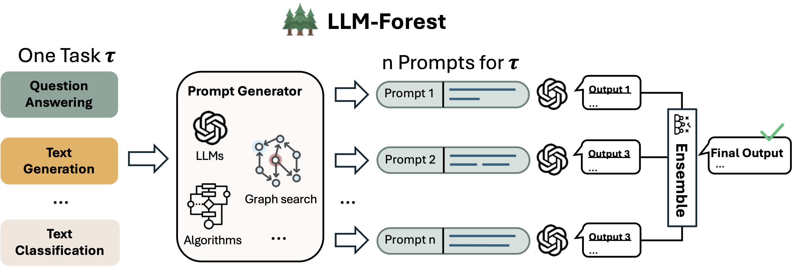
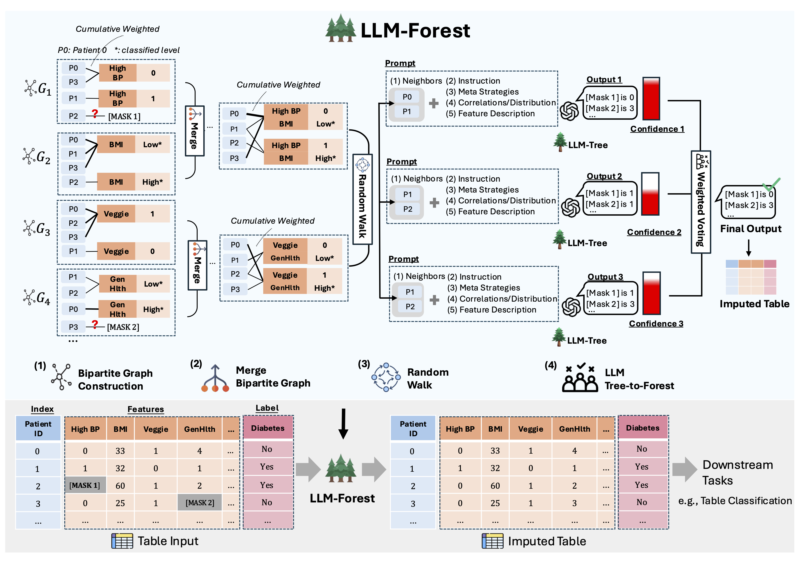

# 🌲 LLM-Forest

This repository contains the implementation of [**LLM-Forest**](https://arxiv.org/abs/2410.21520), our ACL 2025 Findings paper.  
LLM-Forest is a **task-agnostic framework** that ensembles the outputs of multiple large language models (LLMs) based on diverse prompt generations, inspired by the idea of random forests.  

---

## General Framework

LLM-Forest constructs diverse prompts for a given task (e.g., Question Answering, Text Generation, Classification), obtains multiple outputs from LLMs, and aggregates them through self-evaluated confidence-weighted voting.  

<p align="center">
  
</p>
---

## LLM-Forest for Data Imputation

We instantiate LLM-Forest for **tabular data imputation**, where the goal is to fill in missing values in health datasets.  
The process includes graph construction, prompt generation, LLM-based imputation, and ensemble aggregation to yield an **imputed table** for downstream tasks (e.g., classification).

<p align="center">
  
</p>
---

## Reproducing the Results

There are **no strict environment requirements** for this project and it can run under most standard Python setups.  
You can simply install the minimal dependencies with:

```bash
pip install -r requirements.txt
```

To reproduce the results in our paper, here is an example for Diabetes dataset with GPT-4:

```bash
python main.py \
  --data_path ./data/diabetes_train4.csv \
  --dataset diabetes \
  --model_name gpt \
  --num_round 3 \
  --group_size 2 \
  --num_neighbors 5
```
---

## Citation
If you find this work useful, please cite our paper:

```
@inproceedings{he-etal-2025-llm,
    title = "{LLM}-Forest: Ensemble Learning of {LLM}s with Graph-Augmented Prompts for Data Imputation",
    author = "He, Xinrui  and
      Ban, Yikun  and
      Zou, Jiaru  and
      Wei, Tianxin  and
      Cook, Curtiss  and
      He, Jingrui",
    editor = "Che, Wanxiang  and
      Nabende, Joyce  and
      Shutova, Ekaterina  and
      Pilehvar, Mohammad Taher",
    booktitle = "Findings of the Association for Computational Linguistics: ACL 2025",
    month = jul,
    year = "2025",
    address = "Vienna, Austria",
    publisher = "Association for Computational Linguistics",
    url = "https://aclanthology.org/2025.findings-acl.361/",
    doi = "10.18653/v1/2025.findings-acl.361",
    pages = "6921--6936",
    ISBN = "979-8-89176-256-5"
}
```

